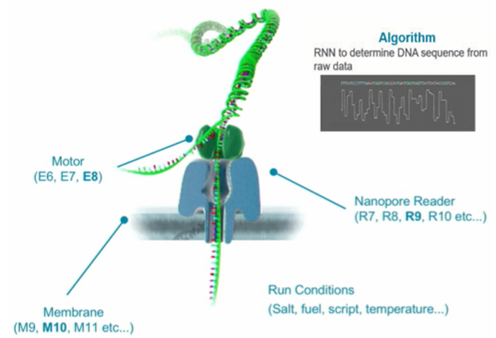
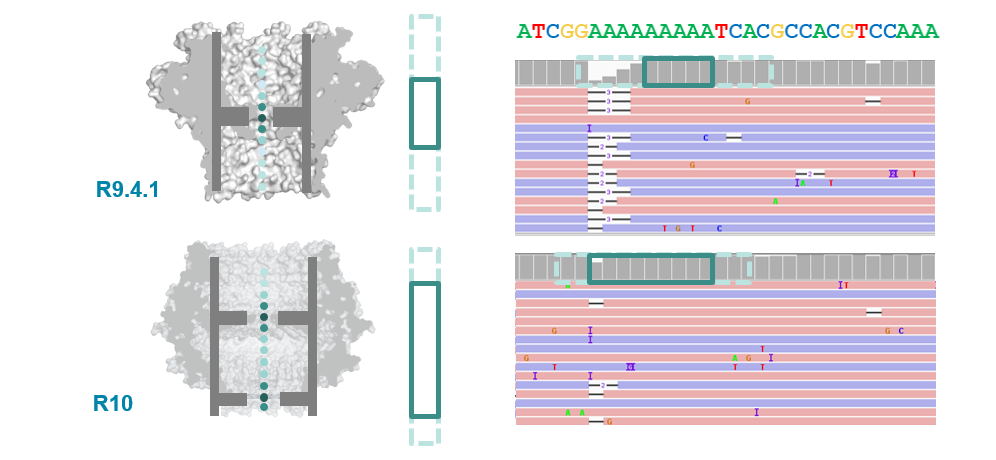

```{r, setup, echo=FALSE}
knitr::opts_chunk$set(echo=FALSE, eval = FALSE, tidy=TRUE)
```

# Introduce

SBL에서 활용중인 Nanopore 활용에 관련한 기본적인 사항들을 소개합니다.

ONT의 경우 신 제품 및 Protocol이 비교적 빠르게 전개되어 [ONT community](https://community.nanoporetech.com/) 를 참고해 자주 확인해 주어야 합니다.

-   기본적인 프로토콜 뼈대는 잘 안변하지만 Pore가 업그레이드, Kit 가 자주 변하는 편.

ONT에관한 전반적인 내용과 SBL에서 활용중인 Kit, 동작에관해 소개합니다. 동작관련 하여는 Protocol마다 조금 상이하여 공식 프로토콜을 참고하는 것이 좋습니다.

## Terminology

**`Flowcell`** : 시퀀싱을 위해 DNA가 통과하게 될 Transporter를 박아놓은 기계 칩.

-   Target throughput에 따라 여러 크기가 존재한다 ex) Flongle, SpotON ...

<!-- -->

-   Transporter 단백질은 버전에 따라 다르며 ex) *E.coli* CsgG.

    Protein Engineering을 통해 Pore의 직경, 깊이를 조절한다.

**`Adapter`** : Sequencing을 위한 추가적인 장치를 Target DNA에 결합시키기 위한 DNA.

> ex) Nanopore : Helicase linked DNA,
>
> illumina : Bridge sequence complementary DNA.

**`Basecalling`** : Nanopore 최초 output인 전류 저항값의 변화 데이터(**Fast5**)를 서열데이터(**Fastq**)로 변환하는 과정, GPU를 활용한 딥러닝으로 수행됨.

**`Tagmentation`** : Transposase를 이용하여 Tag를 붙임과 동시에 DNA를 절단하는 방법. Transposase를 처리하는 시간에 따라 절단된 DNA 길이를 조절할 수 있으며 illumina 시스템에서 주로 활용된다.

## Oxford Nanopore Sequencing Technology (ONT)

기본적으로 Motor protein (helicase / H), Membrane (M), Transporter (R) 3개 단백질이 핵심적으로 작용하며 모두 Protein engineering을 통해 개량해 사용됩니다.\
{alt="Nanopore elements" width="389"}

Sequencing을 위해 DNA or RNA 말단에 Adapter를 부착시켜야 합니다. Adapter와 helicase가 부착된 DNA만 Transporter를 통과하여 Sequencing이 가능합니다. 이때 ATP의 농도가 helicase의 속도 및 transportation 속도를 조절하게 되고 Read quality에 주요한 영향을 줍니다.

그리고, Transporter를 통과할 때 1개의 염기만 통과하지 않고, 5 - 9 개 사이의 염기가 한번에 통과합니다. 이는 서열의 정확도에 큰 영향을 줍니다 (특히 반복서열)



위 사진과 같이 핵심 3개 Protein이 개량될 때 마다 그 성능이 크게 변하며 새로운 Flowcell과 Kit가 출시되어 호환 가능한 키트 및 Flowcell을 사용해야합니다.\
참고 : [R9 vs R10](https://nanoporetech.com/about-us/news/r103-newest-nanopore-high-accuracy-nanopore-sequencing-now-available-store)

# Materials & Kit

## Device

> ONT 동작 장치는 Protein이 일정한 온도를 유지하고 전류를 흘리며 이를 분석할 수 있는 GPU로 구성됩니다.
>
> Device는 동작 가능한 Flowcell 수, GPU 성능에 따라 차등적으로 존재하며 SBL에는 MK1B, MK1C, GridiON이 있습니다.

-   기본적으로 큰 차이는 없지만 MK1B의 경우 온도관리 성능이 떨어진다고 함

-   생성한 데이터를 추후 재 분석(Basecalling)이 가능하기에 GPU 성능이 떨어져도 됨

## Flowcell

> Flowcell은 위에서 설명한 3개 단백질의 버전에 따라 Flowcell 버전이 나뉘며 포장지에 표기되어 있습니다. 기본적으로 Protein의 안정성과 DNA throughput의 차이가 존재하며 원하는 throughput에 따라 적절한 것을 사용합니다.
>
> 내부의 Protein이 죽을 수 있어 온도를 유지해주어야하며 사용 전 Flowcell Check를 통해 꼭 몇개의 Pore가 살아있는지 확인해야합니다.
>
> **Pore 수가 Warranty 기준아래 일시 JCbio에 문의하여 교체 받을 수 있습니다.**

-   22년 8월 현재 Flongle 시 평균 500 mb, SpotON은 평균 10gb 획득 가능합니다.

-   기본적으로 동일한 protein이 존재하지만, flongle이 상대적으로 안정성이 떨어져 read quality가 조금 낮습니다 (현재는 거의 비슷함).

## Ligation Sequencing Kit (LSK)

> LSK109 - 112 등 여러 버전이 존재하며 기본 컨셉은 동일합니다.
>
> TA, DNA 상보결합 Ligation을 통해 Adapter 서열과 Barcode를 차례로 DNA 말단에 부착합니다 (\~ 4h).

-   말단에 부착하는 특성 상 Linear DNA만 활용 가능하여 Circular 및 Genomic DNA는 미리 잘라주는 것이 좋다.

<!-- -->

-   Ligation을 위해 NEB에서 따로 판매하는 ligase들을 필요로 하며 다른 ligase를 사용해도 관계없다, ligation만 되면 되기 때문. 그러나, 추천하는 ligase들이 실험결과상 가장 효율이 높다고한다. [NEB nanopore enzyme](https://international.neb.com/products/e7180-nebnext-companion-module-for-oxford-nanopore-technologies-ligation-sequencing#Product%20Information)

-   Kit 특성상 Adapter가 무조건 DNA의 말단에 붙어 Sequencing이 진행 되기에 분석에 유리하다.

-   아래 RBK kit 대비 throughput이 높다고 알려져 있으나 요즘은 크게 차이가 없는 듯 하다.

-   LSK109는 R9.4.1 + NBD104 / LSK112는 R10.4 + NBD112 등 호환되는 pore protein과 kit가 다르다.

-   AMX, AMII 2가지 종류의 Adapter가 존재하는데 AMII는 Barcoding 시, AMX는 Barcoding 없이 바로 Adapter를 붙일 때 사용한다.

## Rapid Barcoding Kit (RBK)

> Tagmentation 방식으로 DNA를 절단 및 Barcode, Adapter를 부착시킨다. 위 LSK kit에 비해 훨 씬 간편하며 준비시간이 짧다 (\~1h).

-   Protocol에 정해진 시간만 지키면 DNA를 1번만 절단하게 되어 Library 분석에 매우 유리하다.

-   Circular DNA도 분석 가능하며 특성상 Adapter가 중간에 들어가기 때문에 `circular transformation` 등 사후 처리가 필요하다 (Pre-processing 참고).

## Wash Kit

> Flongle의 경우 1회용 이지만 SpotON은 다회 사용이 가능합니다.
>
> DNase를 이용해 내부 DNA를 제거하고 buffer change를 거쳐 재 사용가능한 상태로 만듭니다.
>
> Kit가 오래 될수록 효율이 급감하므로 사용 기간에 맞춰 주문하는 것이 좋습니다 (유효기간 3개월).

## 

## Cas9 Sequencing Kit

> 기본적으로 Ligation Sequencing Kit와 동일 하나 DNA break를 Cas9으로 합니다.
>
> 별도의 gRNA를 제작하여 사용해 주어야 하며 특징으로는 Cas9이 한쪽 strand를 막아 DNA가 읽히는 방향을 한쪽으로 강제할 수 있습니다.
