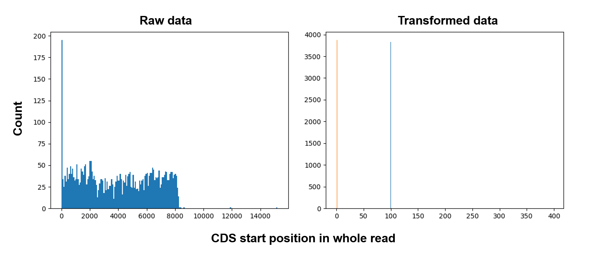

```{r, setup, include=FALSE, echo=FALSE}
knitr::opts_chunk$set(echo=TRUE, eval = FALSE, tidy=TRUE)
library(showtext)
nanum_path = 'C:\\Users\\User\\AppData\\Local\\Microsoft\\Windows\\Fonts\\NanumSquareEB.ttf'

font_paths(nanum_path)
font_add(family = 'NanumSquare', regular = nanum_path)
```

# Introduce

basecalling 후 raw data는 목적에 맞는 pre-processing 과정을 거친다. 해당 과정을 통해 과도한 데이터 크기를 줄이고 원하는 범위의 데이터 혹은 높은 quality의 데이터를 선별 가능하다. (q-score, length filtering)

illumina 시스템의 경우 전처리에 훨씬 많은 과정이 포함된다. 애초에 데이터 양이 매우 많아 (\>100GB) 훨씬 넓은 범위로 전처리하여도 충분한 데이터를 확보할 수 있고, duplicated, chimera read가 많아 제거 할 수록 최종 결과가 눈에 띄게 좋아진다.

그러나, 소개한 nanopore long-read sequencing은 데이터에 불필요한 부분(adapter, barcode 서열 ..)이 상대적으로 매우 적고 전체 데이터 양(throughput)도 적어 전처리 과정이 필수적이지는 않다. 그럼에도 데이터 분석의 편의성, 약간의 quality 상승을 위해 전처리를 해주는 것이 좋다.

아래 `Programs`를 통해 전체 프로그램과 그 활용을 소개하고 `Usage`에서 사용 방법을 소개하였다.8

# Programs

**NanoFilt** : Fastq read를 q-score, length를 기준으로 Filtering.

-   사용한 flowcell, kit 시스템에 따라 Q7, Q10 정도의 기준을 적용하여 평균 점수가 낮은 read는 삭제함. sequencing 초기, 후기 translocation 속도가 일정하지 않을 때 Q5 근처의 저품질 read가 생산 되는데 그것을 삭제 해주는것이 좋음.

-   Assembly DNA 등 서로 다른 길이의 DNA가 존재할 때 길이를 활용한 Filtering으로 데이터 크기를 크게 줄일 수 있음.

    {width="294"}

**porechop** : ONT read 양 말단에 존재하는 barcode + adapter 서열 (약 40 bp)을 trimming 해줌.

-   필수는 아니지만 사용한 서열이 ONT barcode와 겹친다면 제거하는 것이 좋음(ONT barcode 서열은 nanopore protocol 내 표기되어 있음)

**minimap2** : long-read 데이터에 최적화된 assembler, error-rate가 높은 환경에서 assembly가 가능 하도록 설계됨.

-   분석 방향에 맞추어 score matrix 변경 가능

-   circular mapping이 안되어 아래 `circular_transformation` 으로 해결하였음.

**samtools** : alignment format (sam, bam)을 다루기 위한 기본적인 프로그램

**pysam** : samtools와 비슷하며 alignment format을 python으로 pipe 하기위한 패키지

-   python으로 작성한 대부분의 프로그램에 사용 하였으며 개인 마다 최적화된 분석을 하기에 용이하다.

## Self-made Programs

**circular_transformation** : read들의 strand, start position을 고정하기 위하여 제작됨.

-   Transposon 기반의 tagmentation method 사용 시 (RBK004) DNA에서 adapter가 부착되는 위치에 따라 sequencing이 시작되는 위치가 결정된다.

-   CDS와 같이 특정 영역 중간에 adapter가 들어갈 경우 서열이 중간에 끊겨 mapping시 왜곡 되고 특히 reference 서열 양 끝 말단의 mapping 품질이 떨어진다.

    {width="519"}

**Bar_parser** : pysam을 사용하여 특정 획득 가능한 정보(length, CIGAR string, Flag, tag ...) 들을 DataFrame으로 전환하기 위함함

# Usage

#### NanoFilt

```{bash, echo=TRUE}
basecalled_fastq = '/sample/*.fastq.gz'
filtered_fastq = '/sample/analysis/filter.fastq.gz'

gunzip -c $basecalled_fastq | NanoFilt -q [7] -l [3000] --maxlength [5000] | gzip > $filtered_fastq
```

#### Porechop

```{bash, echo=TRUE}
porechop_fastq = '/sample/analysis/trim.fastq.gz'

porechop -i $filtered_fastq --format fastq.gz | gzip > $porechop_fastq
```

### circular_transformation

```{bash, echo=TRUE}
gunzip -c $input_fastq | python circuliar.py -p 200 -n 2 -r $reference
```
