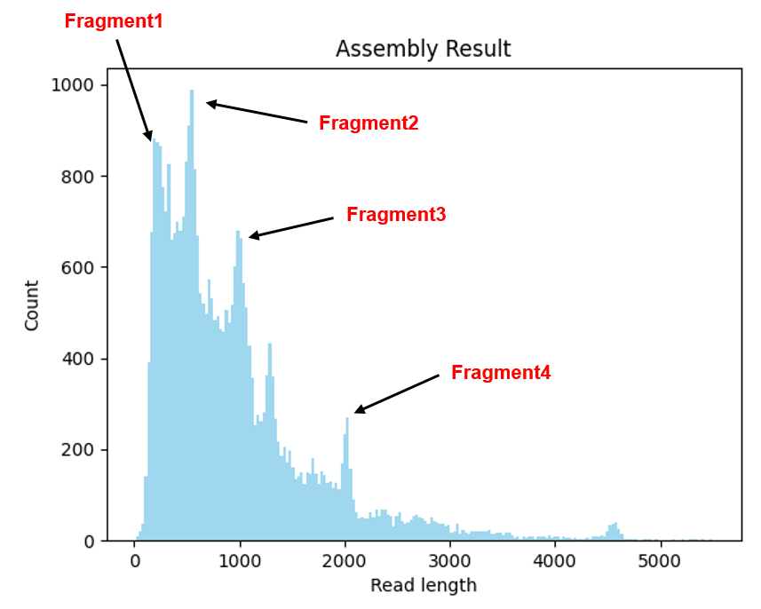
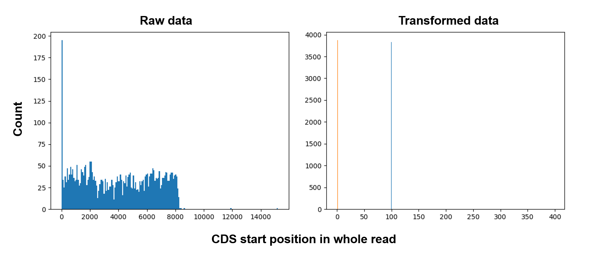
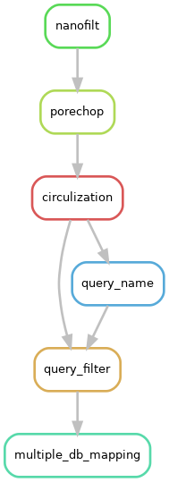

```{r, setup, include=FALSE, echo=FALSE}
knitr::opts_chunk$set(echo=TRUE, eval = FALSE, tidy=TRUE)
```

# Introduce

ONT 동작 후 생성된 데이터의 전처리과정을 소개합니다.

ONT에 의해 생성된 전류 데이터 **(Fast5)**는 **Basecalling** 을 통해 서열데이터 (**Fastq**)로 변환되고 전처리과정을 거쳐 분석에 활용됩니다.

분석 목적에 따라 서로 다른 전처리 과정을 거치는데 일반적으로 불필요한 서열(**Barcode, Adapter** ...)의 제거, **q-score, Read length filtering**이 있습니다.

------------------------------------------------------------------------

illumina 시스템의 경우 read length가 짧아 불필요한 서열이 상대적으로 많고 전체 데이터양이 매우 많아 (\>100GB) 많은 전처리과정을 거쳐도 충분한 데이터를 확보할 수 있습니다 (Duplicated, Chimera read filtering).

그러나, Nanopore의 경우 반대의 이유로 전처리 과정이 필수적이지 않습니다. 그럼에도 특정한 분석 [ex) circular DNA] 의 경우 특정 전처리과정이 필수적입니다.

아래 `Programs`와 `Usage`를 통해 Nanopore 전처리에 활용되는 전체 프로그램과 활용을 소개하고 Docker, Snakemake 등 더 쉽게 활용가능한 추가적인 tool을 소개합니다.

## Terminology

**`Basecalling`** : ONT 최초 output인 전류 저항값의 변화 데이터(**Fast5**)를 서열데이터(**Fastq**)로 변환하는 과정, 딥러닝을 통해 수행됨.

**`phred score (q-score)`** : Basecalling 과정에서 생성한 서열정보의 정확도 Log10을 기준으로 표기한다. [ ex) q-score 20 = 99%, 10 = 90%]

**Barcode** : 한 번에 여러종의 샘플을 처리하기 위하여 (Multiplex) DNA에 부착하는 특정한 서열

Assembly :

**`Sam format`** : Sequence Alignment Format. NGS로 생성된 Read를 Alignment하여 분석하기 위한 파일 포맷 전체 Reference 중 read의 Position, 정확도, 서열 등등.. 매우 많은 정보가 들어있어 이를 어떻게 Pipe 하여 사용하는 지가 분석의 핵심이다. [SamFormat](https://en.wikipedia.org/wiki/SAM_(file_format))

# Programs

**`NanoFilt`** : Fastq 파일을 q-score, length를 기준으로 Filtering.

-   사용한 flowcell, kit 시스템에 따라 Q7, Q10 정도의 기준을 적용하여 평균 점수가 낮은 read는 삭제하는 것이 좋습니다.

    sequencing 초기, 후기 translocation 속도가 일정하지 않을 때 저품질 read가 생산 되는데 그것을 삭제 해주는것이 좋음.

-   Assembly DNA 등 서로 다른 길이의 DNA가 존재할 때 길이를 활용한 Filtering으로 데이터 크기를 크게 줄일 수 있음 (아래 그림 참고).

    {width="294"}

**`NanoLyse`** : 전체 read중 특정 reference에 mapping 된 read를 제거하기 위함.

-   Library 제작 중 첨가되는 DCS를 제거 하기 위한 프로그램.

-   Metagenome library 중 Vector서열만 제거 하는 등 활용 가능

-   Trimming이 아니라 해당 Read를 통째로 제거하므로 주의

**`porechop`** : Read 양 끝에 존재하는 barcode + adapter 서열 (약 40 bp)을 제거하며 2개이상의 Adapter 가 발견된 Chimera read도 제거함.

-   필수는 아니지만 사용한 서열이 ONT barcode와 겹친다면 제거하는 것이 좋음

    (ONT barcode 서열은 nanopore protocol 내 표기되어 있음)

-   자체적인 Tag(barcode) 부착 시 안하는게 좋음 (말단이 많이 잘려 분석에 오류가 생길 수 있음)

**`minimap2`** : long-read 데이터에 최적화된 assembler, error-rate가 높은 환경에서 assembly가 가능 하도록 설계됨.

-   분석 방향에 맞추어 score matrix 변경 가능

-   circular mapping이 안되어 아래 `circular_transformation` 으로 해결하였음.

**`samtools`** : SAM format을 다루기 위한 기본적인 프로그램.

**`pysam`** : SAM format을 Python으로 다루기 위한 패키지 python에 익숙한 경우 최적화된 분석을 하는데 용이하다.

## Self-made Programs

**`circular_transformation`** : read들의 strand, start position을 고정하기 위하여 제작됨.

-   Transposase 기반의 tagmentation method 사용 시 (RBK004) DNA에서 adapter가 부착되는 위치에 따라 sequencing이 시작되는 위치가 결정된다.

-   CDS와 같이 특정 영역 중간에 adapter가 들어갈 경우 서열이 중간에 끊겨 mapping시 왜곡 되고 특히 reference 서열 양 끝 말단의 mapping 품질이 떨어진다.

    {width="519"}

**Bar_parser** : `Pysam`을 사용하여 Sam format의 분석을 하기 위해 제작한 함수 모음. CIGAR, Flag, position 등 최적화된 분석을 가능하게함.

-   Reference에 대한 querycover가 높은 read 선별 등 기존 보다 더 정확한 분석을 가능하게함.

# Usage

#### NanoFilt

```{bash, echo=TRUE}
basecalled_fastq = '/sample/*.fastq.gz'
filtered_fastq = '/sample/analysis/filter.fastq.gz'

gunzip -c $basecalled_fastq | NanoFilt -q [7] -l [3000] --maxlength [5000] | gzip > $filtered_fastq
```

#### NanoLyse

```{bash}
gunzip -c $basecalled_fastq | NanoLyse -r {reference.fasta} | gzip > $output_fastq
```

#### Porechop

```{bash, echo=TRUE}
porechop_fastq = '/sample/analysis/trim.fastq.gz'

porechop -i $filtered_fastq --format fastq.gz | gzip > $porechop_fastq
```

### circular_transformation

```{bash, echo=TRUE}
gunzip -c $input_fastq | python circular_transpormation.py -p {200} -n {2} -r $reference
```

# Snake Make

[Snakemake](https://snakemake.readthedocs.io/en/stable/)는 pipeline 제작 프로그램으로 bash, python을 통해 진행되는 위 과정을 하나로 엮어 한번에 진행되게 해줍니다.

반복적인 Pre-processing 과정을 한번에 진행되게 합니다.

```{bash}
snakemake {output} -j {12}
```

#### SnakeFile Architecture

사용한 Pre-processing을 엮은 script가 입니다. 실행하고자 하는 최종 output을 적으면 위 프로그램들이 순차적으로 시행됩니다.

{width="174"}
